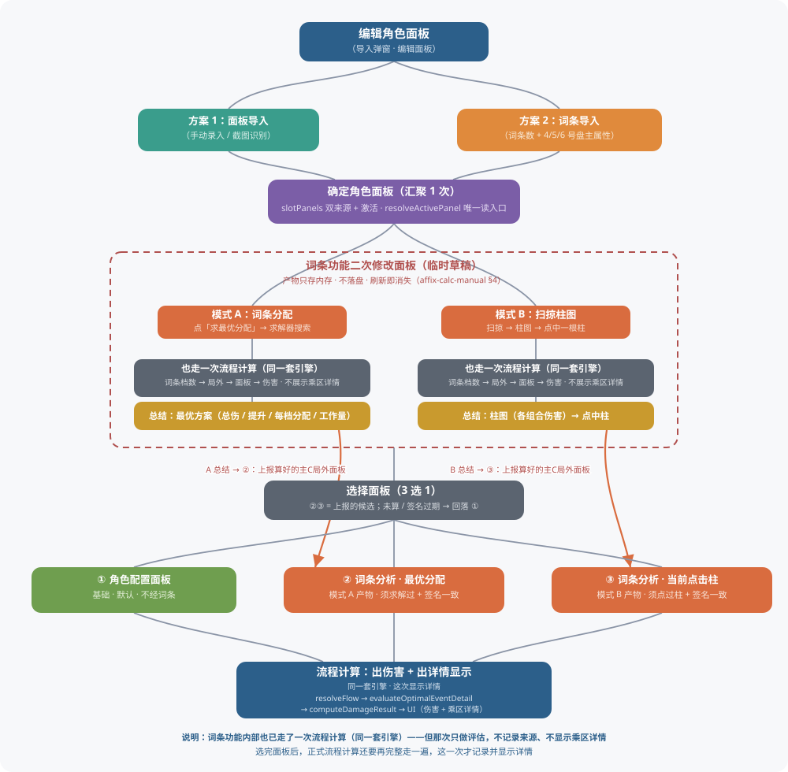

# 面板 → 词条二次修改 → 流程计算 · 链路说明

> **性质**：说明图，**不是新规格**。行为口径以 [伤害计算页改动汇总（2026-09）](./damage-calc-changes-2026-09.md) 与代码为准。
> 开发者详细手册（含逐条依据）在仓库外 `dev-docs/panel-affix-flow.md`（不进开源仓库）。

## 思维导图



## 重点说明

> **词条功能内部也已走了一次流程计算（同一套引擎）——但那次只做评估，不记录来源、不显示乘区详情**
> 选完面板后，正式流程计算还要再完整走一遍，这一次才记录并显示详情。

## 链路（文字版）

```
编辑角色面板（导入弹窗）
  方案1 面板导入 / 方案2 词条导入 ──→ 确定角色面板（slotPanels 双来源 + resolveActivePanel 唯一读入口）
    ↓
词条功能二次修改面板（临时草稿，产物只存内存 · 不落盘）
  模式 A：词条分配（点「求最优分配」→ 求解器） ／ 模式 B：扫掠柱图（扫掠 → 点中柱）
  两种模式内部都走一次流程计算（同一套引擎，evaluateAffixCounts 真算），但这次不记录来源、不显示乘区详情
  结果就绪时：总结（总伤/提升/分档）展示 + 算好的当前编辑角色局外面板上报（watch 自动触发；未算过上报 null）
    ↓
选择面板（3 选 1）——① 角色配置面板（基础，不经词条）／ ② 最优分配（模式A产物）／ ③ 当前点击柱（模式B产物）
  ②③ 未算过或签名过期 → 回落 ①
    ↓
流程计算：出伤害 + 出详情显示（同一套引擎，这次才记录并显示乘区详情）
  resolveFlow → evaluateOptimalEventDetail → computeDamageResult → UI
```

## 关键实现点（代码位置）

| 点 | 位置 |
|---|---|
| 词条分析两种模式（词条分配 / 扫掠柱图） | `zzz-hp/src/components/calculator/OptimalAffixAllocSection.vue` |
| 上报候选面板（`emitPanelSourceOptions`，watch 触发，报算好的面板而非词条数） | `OptimalAffixAllocSection.vue:1093-1125`（watch 在 `:1515-1524`） |
| 三态与候选、签名过期回落 | `zzz-hp/src/utils/skillFlowPanelSource.ts`（`resolveSkillFlowPanelSource:141-157`） |
| 词条分析内的计算链路（不展示乘区详情） | `zzz-hp/src/utils/optimalAffixAlloc.ts`（`evaluateAffixCounts` / `evaluateOptimalEventDetail`） |
